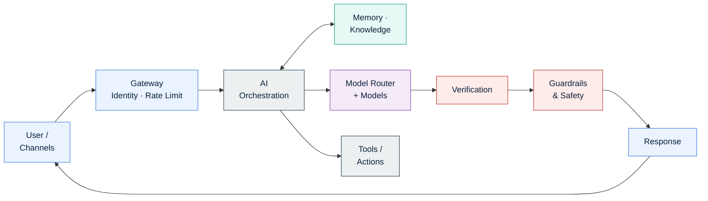

<div align="center">

# EASRA
### Enterprise AI Systems Reference Architecture

**An open reference architecture for designing, building, operating, governing, securing, observing, and verifying production-grade Enterprise AI and Agentic AI systems.**

*Vendor-neutral · Standards-aligned · Community-governed*

*Version 0.1 (Draft) — 2026*

[](https://opensource.org/licenses/Apache-2.0)
[](https://creativecommons.org/licenses/by/4.0/)
[]()
[]()
[]()
[](./CONTRIBUTING.md)
[]()

[Specification](./specification/) · [Architectures](./architectures/) · [Handbook](./handbook/) · [Implementations](./implementations/) · [Benchmarks](./benchmarks/) · [Security](./security-reference/) · [Verification](./verification-reference/) · [LLMOps](./llmops-guide/) · [Checklists](./checklists/) · [Templates](./templates/) · [ADRs](./adr/) · [Diagrams](./diagrams/CATALOGUE.md)

</div>

---

## Project Status

**Version:** 0.1 (Draft) · **License:** Apache-2.0 (code) + CC-BY-4.0 (docs) · **Governance:** Open, community-contributable

| Deliverable | Status |
|---|---|
| Architecture Specification (12 numbered docs) | ✅ Draft available |
| Layer Model (16 layers) | ✅ Draft available |
| Runtime & Reference Architectures (5 views) | ✅ Draft available |
| Capability Model & Component Catalogue | ✅ Frozen (v0.1) |
| Diagram Catalogue | ✅ Inventory published |
| Architecture Decision Records | ✅ Active |
| Handbook (per-layer deep-dives) | 🚧 In progress |
| Reference Implementation | 🚧 Planned |
| Cloud Mappings (Azure / AWS / GCP) | 🚧 In progress |
| Benchmarks | 🚧 Scaffolded |

Full release plan: [ROADMAP.md](./ROADMAP.md).

---

## Architecture at a Glance



This is the simplified request path. The full 16-layer architecture — with cross-cutting Security, Governance, Observability, LLMOps, Cost and Value layers — is in [diagrams/high-level-architecture.md](./diagrams/high-level-architecture.md).

---

## Who is EASRA for?

| Role | What you get from EASRA |
|---|---|
| 🏛 **Enterprise Architects** | A vendor-neutral reference model, capability model, and trust-boundary map for Enterprise AI. |
| 🤖 **AI / ML Architects** | A layered decomposition of orchestration, memory, retrieval, model routing, verification. |
| ⚙ **Platform Engineers** | Component catalogue, interface contracts, deployment and operational views. |
| 💻 **Software Architects & Engineers** | Patterns, anti-patterns, sequence diagrams, and worked examples. |
| 🛡 **Security Architects & Red Teams** | Threat catalogue (OWASP LLM, MITRE ATLAS), controls catalogue, threat-model templates. |
| 📈 **Engineering / AI Platform Managers** | Roadmap language, staffing model, adoption checklists, conformance levels. |
| 🔬 **Researchers & Standards Bodies** | An open, citable model to build on, critique, and extend. |
| 🎓 **Students & Educators** | A single coherent architecture to teach production Enterprise AI. |

If any of these describe you — EASRA is written for you.

---

## Why EASRA

Enterprise AI has moved from *"pick a model"* to *"design a distributed system"*. Production AI platforms now combine foundation models, retrieval, memory, agent orchestration, tool use, security, governance, observability, and verification — all under tight latency, cost, and compliance budgets.

There is no widely adopted, vendor-neutral reference architecture for that reality. Existing guidance is either vendor-specific (Azure/AWS/GCP architecture centres), framework-specific (LangChain, LlamaIndex, Semantic Kernel), or narrowly scoped (RAG, agents, LLMOps). Teams are left to reinvent the same architecture — memory placement, guardrails, model routing, cache planes, trust boundaries — over and over.

**EASRA draws inspiration from architectural reference frameworks such as TOGAF and layered models such as OSI**, providing a common architectural vocabulary and reference model for Enterprise AI: a layered decomposition, explicit interfaces, and a body of patterns and anti-patterns that separates *architecture* from *implementation*.

## What EASRA is

- **A layered reference architecture** — 16 logical layers with explicit responsibilities and interfaces.
- **A capability model** — 16 frozen capability domains and their subcapabilities ([Spec 011](./specification/011-capability-model.md)).
- **A component catalogue** — the frozen inventory of every named component with a stable ID scheme ([Spec 012](./specification/012-component-catalogue.md)).
- **A specification suite** — 12 numbered specs (introduction, principles, terminology, reference architecture, layers, interfaces, data flow, sequences, trust boundaries, NFRs, capability model, component catalogue).
- **Five architecture views** — Logical, Runtime, Deployment, Operational, Security ([architectures/](./architectures/)).
- **A publication-quality diagram library** — inventoried in the [Diagram Catalogue](./diagrams/CATALOGUE.md) (target: ~25 diagrams across the five views).
- **A handbook** — deep-dive per-layer chapters covering components, patterns, anti-patterns, failure modes, cloud mappings, and production checklists.
- **A reference implementation** — an open-source, minimal, spec-compliant Enterprise AI system.
- **A body of ADRs and research** — decision records and forward-looking work (execution compilers, verification frameworks, benchmarks).

## What EASRA is not

- Not a product, a framework, a runtime, or a hosted service.
- Not tied to any LLM vendor, cloud provider, agent framework, or programming language.
- Not a replacement for TOGAF, NIST AI RMF, OWASP LLM Top 10, MITRE ATLAS, or OpenTelemetry — EASRA *complements* and *references* them.
- Not a governance policy — EASRA gives the architectural surface on which policies operate.

## Deliverables

EASRA is structured as an open reference architecture and community specification, not a repository of examples. It is intended to become the central place where architects, engineers, security teams, and researchers come to learn, contribute, and build Enterprise AI systems. It ships as ten distinct deliverables:

| # | Deliverable | What it is | Status | Location |
|---|-------------|------------|--------|----------|
| 1 | 📘 **Architecture Specification** | The 12 numbered normative specs (principles, layers, interfaces, capabilities, components, NFRs, trust boundaries). | Draft (v0.1) | [`specification/`](./specification/) |
| 2 | 📖 **Handbook** | Per-layer engineering deep-dives (components, patterns, anti-patterns, failure modes, cloud mappings, checklists). | Scaffolded | [`handbook/`](./handbook/) |
| 3 | 🏗 **Reference Architectures** | Five architecture views (Logical, Runtime, Deployment, Operational, Security) with ~25 catalogued diagrams. | Scaffolded | [`architectures/`](./architectures/) + [`diagrams/CATALOGUE.md`](./diagrams/CATALOGUE.md) |
| 4 | ☁ **Cloud Implementations** | Concrete Azure / AWS / GCP / open-source mappings of every layer, component, and NFR. | Draft | [`implementations/`](./implementations/) |
| 5 | 🧪 **Benchmarks** | Reproducible latency, cost, safety, verification, cache, and reliability measurements against standard workloads. | Scaffolded | [`benchmarks/`](./benchmarks/) |
| 6 | 📊 **Architecture Decision Records** | Every structural decision recorded, reviewable, and reversible. | Active | [`adr/`](./adr/) |
| 7 | 🛡 **Security Reference** | Threat catalogue (OWASP LLM, MITRE ATLAS), controls catalogue, standards mappings, threat models, red-team playbook. | Draft | [`security-reference/`](./security-reference/) |
| 8 | 🔍 **AI Verification Reference** | The seven verification classes, reference checkers, grounding metrics, golden-set methodology, continuous verification. | Draft | [`verification-reference/`](./verification-reference/) |
| 9 | 📈 **LLMOps Guide** | Delivery pipeline, prompt / model / tool lifecycles, evaluation strategy, cost engineering, incident response. | Draft | [`llmops-guide/`](./llmops-guide/) |
| 10 | 🎓 **Conference & Community Materials** | Talk decks, workshops, abstracts — reusable under CC-BY-4.0. | Planned | [`conference/`](./conference/) |

Roadmap for each deliverable is tracked in [ROADMAP.md](./ROADMAP.md).

## Core Design Principles

| # | Principle | One-line statement |
|---|-----------|--------------------|
| P1 | Vendor Neutrality | The architecture is defined in logical terms; every layer must map cleanly to at least two independent implementations. |
| P2 | Security by Design | Zero-trust, least-privilege, and prompt-injection resistance are architectural — not add-on — concerns. |
| P3 | Verification by Design | Every AI output is verifiable; verification is a first-class layer, distinct from evaluation. |
| P4 | Observability by Default | Traces, metrics, logs, token/cost accounting, and agent/tool traces are emitted from every component. |
| P5 | Loose Coupling | Layers communicate only through published interfaces; no layer depends on another's internals. |
| P6 | Externalized State | Memory, sessions, and caches live outside compute; compute is stateless and horizontally scalable. |
| P7 | Human-in-the-Loop | Every autonomous action has a defined escalation, override, and audit path. |
| P8 | Failure Isolation | Failure in one layer degrades the system gracefully; no single layer can cascade a full outage. |
| P9 | Cost Awareness | Token, compute, and storage cost are explicit design inputs, not afterthoughts. |
| P10 | Evolvability | New models, tools, agents, and channels can be added without redesigning the architecture. |

Full definitions live in [specification/002-design-principles.md](./specification/002-design-principles.md).

## The 16 EASRA Layers

```
L0   Channels & User Experience
L1   Edge · Gateway · Identity          ── Trust Boundary A ──
L2   AI Orchestration
L3   Prompt Intelligence
L4   Memory & Context
L5   Knowledge & Retrieval
L6   AI Models & Model Router
L7   Tooling & Actions (MCP, APIs)
L8   Guardrails & Safety                ── Trust Boundary B ──
L9   Verification
L10  Observability & Evaluation
L11  Performance, Caching & Cost
L12  LLMOps & Delivery (CI/CD)
L13  Security & Zero Trust               (cross-cutting)
L14  Governance, Risk & Compliance       (cross-cutting)
L15  Business Outcomes & Value
```

The full high-level architecture diagram is in [diagrams/high-level-architecture.md](./diagrams/high-level-architecture.md). The complete diagram inventory across all five views is in the [Diagram Catalogue](./diagrams/CATALOGUE.md).

## The Five Architecture Views

EASRA is described through five architecture views, each answering different questions for a different audience. All views derive from the frozen [Capability Model](./specification/011-capability-model.md) and reference only components in the [Component Catalogue](./specification/012-component-catalogue.md).

| View | Answers | Audience | Folder |
|------|---------|----------|--------|
| **Logical** | What are the parts and how do they compose? | Architects | [architectures/logical/](./architectures/logical/) |
| **Runtime** | How does a request execute across the parts? | Engineers, SREs | [architectures/runtime/](./architectures/runtime/) |
| **Deployment** | Where does each part run, and how is it scaled? | Platform, SRE | [architectures/deployment/](./architectures/deployment/) |
| **Operational** | How is the system observed, evaluated, delivered? | SRE, LLMOps | [architectures/operational/](./architectures/operational/) |
| **Security** | What are the trust boundaries and controls? | Security, Audit | [architectures/security/](./architectures/security/) |

See [architectures/README.md](./architectures/README.md) for the full view.

## Repository Structure

```
EASRA/
├── docs/                     Documentation-site config and assets (planned MkDocs / Docusaurus / Nextra)
├── specification/            12 numbered specification documents (001–012)
├── architectures/            Five architecture views (logical, runtime, deployment, operational, security)
├── handbook/                 Per-layer chapters and cross-cutting guides
├── diagrams/                 Publication-grade Mermaid + drawio diagrams (see CATALOGUE.md)
├── implementations/          Azure / AWS / GCP / open-source realisations
├── benchmarks/               Reproducible latency, cost, safety, verification measurements
├── security-reference/       Threats, controls, standards mappings, threat models, red-team
├── verification-reference/   Verification classes, checkers, metrics, golden-set methodology
├── llmops-guide/             Delivery, lifecycle, evaluation strategy, cost, incident response
├── checklists/               Repository-quality, adoption, security, verification, LLMOps checklists
├── templates/                Profile README, repo starter, style guide, adopter templates
├── examples/                 Worked example architectures (single-agent, multi-agent, RAG, tool-use)
├── reference-implementation/ Minimal spec-compliant open-source implementation
├── adr/                      Architecture Decision Records
├── research/                 Forward-looking work (compilers, verification, benchmarks)
├── conference/               Talk decks, workshops, tutorials
├── CONTRIBUTING.md
├── GOVERNANCE.md
├── ROADMAP.md
├── CHANGELOG.md
└── LICENSE                   Apache-2.0 (code) + CC-BY-4.0 (docs)
```

## Getting Started

- **If you are an architect** → start with [specification/001-introduction.md](./specification/001-introduction.md), then [004-reference-architecture.md](./specification/004-reference-architecture.md).
- **If you are an engineer** → start with [diagrams/high-level-architecture.md](./diagrams/high-level-architecture.md), then [005-layer-definitions.md](./specification/005-layer-definitions.md).
- **If you are evaluating EASRA for adoption** → read the [ROADMAP](./ROADMAP.md) and [GOVERNANCE](./GOVERNANCE.md).
- **If you want to contribute** → read [CONTRIBUTING.md](./CONTRIBUTING.md) and pick an [open ADR](./adr/).

## Status

EASRA is a **draft** working toward v1.0. Interfaces and layer boundaries may change. See [CHANGELOG.md](./CHANGELOG.md) for revision history and [ROADMAP.md](./ROADMAP.md) for the release plan.

## FAQ

<details>
<summary><b>Why another architecture? Isn't this a solved problem?</b></summary>

No production-grade, vendor-neutral, publicly reviewable reference architecture exists for Enterprise AI. Cloud vendors publish architecture centres for their own stacks. Framework vendors publish patterns for their own frameworks. Analyst firms publish market maps. None of them define the *architectural surface* \u2014 layers, interfaces, capabilities, trust boundaries, NFRs \u2014 that a team can adopt independently of any vendor. EASRA fills that gap.
</details>

<details>
<summary><b>How is EASRA different from LangChain, LlamaIndex, or Semantic Kernel?</b></summary>

Those are **implementation frameworks**. EASRA is an **architecture**. LangChain answers *"how do I compose an agent in Python?"*. EASRA answers *"what layers, interfaces, and trust boundaries should exist in my platform, regardless of what framework I use?"*. You can implement EASRA using LangChain, Semantic Kernel, your own runtime, or none of them.
</details>

<details>
<summary><b>Does EASRA replace TOGAF, NIST AI RMF, ISO 42001, or OWASP LLM Top 10?</b></summary>

No. EASRA *complements* and *references* them. TOGAF defines enterprise-architecture methodology. NIST AI RMF and ISO 42001 define governance and risk-management frameworks. OWASP LLM Top 10 and MITRE ATLAS define threat taxonomies. EASRA gives you the architectural surface on which those methodologies, controls, and threats operate.
</details>

<details>
<summary><b>Is EASRA Azure-specific? AWS-specific?</b></summary>

No. The specification is intentionally vendor-neutral. The [`implementations/`](./implementations/) folder contains mappings to Azure, AWS, GCP, and open-source stacks so architects can see how each layer maps to concrete services on each cloud.
</details>

<details>
<summary><b>Is EASRA only for LLM applications, or also for agents?</b></summary>

Both. The layer model covers single-model applications, RAG systems, tool-use agents, and multi-agent systems. Agent-specific concerns \u2014 tool schemas, action authorisation, memory scoping, orchestration patterns \u2014 are first-class in Layers 2, 4, and 7.
</details>

<details>
<summary><b>Can I use EASRA commercially?</b></summary>

Yes. Code is Apache 2.0. Documentation, diagrams, and specifications are CC-BY-4.0. You can adopt, adapt, and build commercial products on top of EASRA \u2014 attribution appreciated.
</details>

<details>
<summary><b>How do I contribute?</b></summary>

Read [CONTRIBUTING.md](./CONTRIBUTING.md), open an issue, propose an [ADR](./adr/), or submit a PR against any deliverable. Design proposals, cloud mappings, worked examples, threat models, and reference-implementation code are all welcome.
</details>

<details>
<summary><b>Is EASRA a standard?</b></summary>

Not yet. EASRA is an **open reference architecture** and community specification. Standardisation is a governance milestone that requires broad adoption and multi-organisation stewardship \u2014 both future goals, not current claims.
</details>

## Citing EASRA

```
Karthikeyan Dhanakotti. (2026). Enterprise AI Systems Reference Architecture (EASRA), v0.1.
https://github.com/KarthikeyanDhanakotti/EASRA
```

## License

- **Documentation, specifications, diagrams**: [Creative Commons Attribution 4.0 (CC-BY-4.0)](./LICENSE)
- **Code and reference implementation**: [Apache License 2.0](./LICENSE)

## Maintainer

**Karthikeyan Dhanakotti** — [@KarthikeyanDhanakotti](https://github.com/KarthikeyanDhanakotti)

Contributions, issues, and design proposals are welcome. See [CONTRIBUTING.md](./CONTRIBUTING.md).
