# CI/CD Pipeline

Companion diagram to [Specification 004 §5.3](../specification/004-reference-architecture.md) and Layer L12 in [Specification 005](../specification/005-layer-definitions.md).

## 1. Delivery pipeline (L12 · TP-2)

```mermaid
flowchart LR
    D[Developer]:::dev
    GH[GitHub / Git]:::src
    PR[Pull Request<br/>review · CODEOWNERS]:::src

    subgraph CI["CI Pipeline"]
        direction TB
        LINT[Lint · Format]:::ci
        SA[Static Analysis]:::ci
        SEC[Security Scan<br/>SAST · deps · secrets · SBOM]:::ci
        PT[Prompt Tests<br/>golden prompts · schema]:::ci
        EV[Evaluation Gate<br/>regression on eval sets]:::ci
        UT[Unit + Contract Tests]:::ci
    end

    subgraph Build["Build & Sign"]
        direction TB
        CB[Container Build]:::build
        MB[Model Bundle]:::build
        SG[Sign · SLSA provenance]:::build
    end

    subgraph Reg["Registries"]
        direction LR
        AR[Artefact Registry]:::reg
        PRG[Prompt Registry]:::reg
        MR[Model Registry]:::reg
        TR[Tool Registry]:::reg
    end

    subgraph CD["CD Pipeline"]
        direction TB
        POL[Policy Gate<br/>L14 approvals]:::cd
        CANARY[Canary Deploy<br/>N% traffic]:::cd
        SLO[SLO Watch<br/>error / latency / cost / verdict]:::cd
        BG[Blue/Green Switch]:::cd
        PROD[Production]:::cd
        RB[Auto-Rollback<br/>on SLO breach]:::cd
    end

    D --> GH --> PR
    PR --> LINT --> SA --> SEC --> PT --> EV --> UT
    UT --> CB
    UT --> MB
    CB --> SG --> AR
    MB --> SG
    PT --> PRG
    MB --> MR
    UT --> TR
    AR --> POL --> CANARY --> SLO
    SLO -->|healthy| BG --> PROD
    SLO -->|regression| RB

    classDef dev fill:#0f172a,stroke:#0f172a,color:#f8fafc
    classDef src fill:#38bdf8,stroke:#0c4a6e,color:#ffffff
    classDef ci fill:#c084fc,stroke:#581c87,color:#ffffff
    classDef build fill:#a78bfa,stroke:#4c1d95,color:#ffffff
    classDef reg fill:#facc15,stroke:#713f12,color:#111827
    classDef cd fill:#34d399,stroke:#065f46,color:#022c22
```

## 2. Gate summary

| Gate | Owner | Blocks promotion on |
|------|-------|---------------------|
| Lint / format | CI | Style violations |
| Static analysis | CI | Type/logic errors |
| Security scan | CI / L13 | Vulnerable deps, leaked secrets, SBOM issues |
| Prompt tests | CI / L3 | Prompt regression, schema drift |
| Evaluation gate | CI / L10 | Eval score regression beyond threshold |
| Unit + contract | CI | Test failures |
| Sign / SLSA | Build / TP-2 | Unsigned artefact |
| Policy gate | CD / L14 | Model class not approved, prompt not registered |
| Canary + SLO watch | CD | Error, latency, cost, or verdict regression |

## 3. Change log

- **0.1.0 (2026-07-05)** — Initial CI/CD pipeline diagram.
