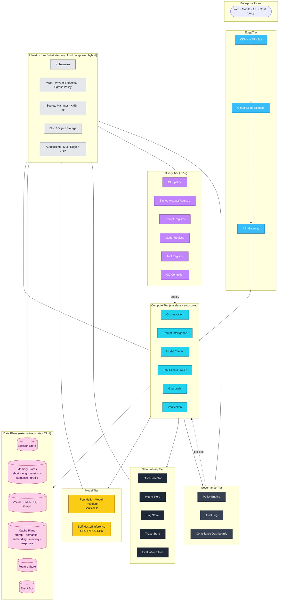

# Deployment Topology

Companion diagram to [Specification 004 §8](../specification/004-reference-architecture.md#8-deployment-topology-logical).

## 1. Logical deployment topology

## 2. Tier responsibilities (summary)

| Tier | Owns | Scales |
|------|------|--------|
| Edge | Termination, WAF, LB, gateway | Global points-of-presence |
| Compute | L2, L3, L6, L7, L8, L9 runtimes | Horizontal (P6) |
| Data plane | L4, L5, L11 stores | Per-store class (kv, vector, sql, cache) |
| Model tier | Provider APIs + self-hosted inference | Provider quotas or GPU/NPU fleet |
| Observability | L10 collectors and stores | Cardinality-driven |
| Delivery | L12 pipelines and registries | Build farm |
| Governance | L14 policy, audit, compliance | Low-volume, high-durability |
| Infrastructure | Kubernetes, network, secrets, storage, autoscale | Cluster-wide |

## 3. Cloud-mapping recipe

The topology is deliberately vendor-neutral. Each tier has ≥ 2 implementations on each cloud (Azure, AWS, GCP) and open-source. The mapping tables live in the handbook chapters for each layer.

## 4. Change log

- **0.1.0 (2026-07-05)** — Initial logical deployment topology.
