# EASRA High-Level Architecture

**The canonical high-level reference diagram for Enterprise AI Systems.**

This diagram is the visual entry point to EASRA. It shows the sixteen layers, the request/response path, the cache plane, the four trust boundaries, and the three cross-cutting planes (Security, Observability, Governance). It maps 1:1 to [Specification 004 — Reference Architecture](../specification/004-reference-architecture.md).

The diagram is provided in three forms:

1. **Mermaid** — the source of truth, renders natively on GitHub, easy to fork and adapt.
2. **ASCII (planar)** — for terminals, plain-text docs, and slides that reject Markdown.
3. **Color-coded plane view** — for the handbook cover and presentations.

For deployment topology see [`deployment-topology.md`](./deployment-topology.md). For threat-model annotations see [`trust-boundaries.md`](./trust-boundaries.md). For CI/CD see [`cicd-pipeline.md`](./cicd-pipeline.md).

---

## 1. Mermaid — the canonical diagram

```mermaid
flowchart TB
    %% ============ CLIENTS ============
    U([Enterprise Users<br/>Web · Mobile · API · Chat · Voice]):::user

    %% ============ L0 & L1 ============
    subgraph EDGE["EDGE  ·  L0 Channels  +  L1 Gateway / Identity"]
        direction TB
        L0["L0 · Channel Adapter<br/>Web · Mobile · Chat · API · Voice · SDK"]:::l0
        CDN["CDN · WAF · Bot Protection"]:::l1
        GLB["Global Load Balancer"]:::l1
        GW["API Gateway"]:::l1
        AUTH["Authentication<br/>OIDC · OAuth2 · SSO"]:::l1
        AZ["Authorization<br/>coarse-grained"]:::l1
        RL["Rate Limiter · Quota"]:::l1
        SM["Session Manager<br/>externalized state"]:::l1
        RV["Request Validator"]:::l1
    end

    %% ============ L2 ORCHESTRATION ============
    subgraph ORCH["L2  ·  AI Orchestration"]
        direction TB
        ROUTER["AI Router"]:::l2
        SA["Single Agent"]:::l2
        MA["Multi-Agent Coordinator"]:::l2
        PLAN["Planner /<br/>Workflow Engine"]:::l2
    end

    %% ============ L3 PROMPT INTELLIGENCE ============
    subgraph PROMPT["L3  ·  Prompt Intelligence"]
        direction TB
        CB["Context Builder"]:::l3
        PB["Prompt Builder"]:::l3
        PR["Prompt Registry<br/>versioned templates"]:::l3
    end

    %% ============ L4 MEMORY ============
    subgraph MEM["L4  ·  Memory & Context"]
        direction TB
        MM["Memory Manager"]:::l4
        ST["Short-Term"]:::l4s
        LT["Long-Term"]:::l4s
        SS["Session Memory"]:::l4s
        SEM["Semantic Memory"]:::l4s
        UP["User Profile"]:::l4s
    end

    %% ============ L5 KNOWLEDGE ============
    subgraph KNOW["L5  ·  Knowledge & Retrieval"]
        direction TB
        RR["Retrieval Router"]:::l5
        VDB["Vector DB<br/>kNN"]:::l5s
        BM25["Keyword Index<br/>BM25"]:::l5s
        SQL["Structured / SQL"]:::l5s
        GRAPH["Graph DB"]:::l5s
        RERANK["Reranker"]:::l5s
    end

    %% ============ L6 MODELS ============
    subgraph MOD["L6  ·  AI Models & Model Router"]
        direction TB
        MR["Model Router<br/>capability · cost · latency · policy"]:::l6
        FM["Foundation Models<br/>GPT · Claude · Gemini · Llama"]:::l6s
        SMM["Small / Specialised<br/>classify · rerank · embed"]:::l6s
        MRG["Model Registry"]:::l6
    end

    %% ============ L7 TOOLS ============
    subgraph TOOL["L7  ·  Tooling & Actions  (MCP)"]
        direction TB
        TR["Tool Router"]:::l7
        MCP["MCP Client ⇄ MCP Servers"]:::l7s
        ENT["Enterprise APIs<br/>SaaS · Legacy · Internal"]:::l7s
        IMP["Impact-Class Enforcer<br/>read · write · high-impact"]:::l7
        TREG["Tool Registry"]:::l7
    end

    %% ============ L11 CACHE PLANE ============
    subgraph CACHE["L11  ·  Performance · Caching · Cost"]
        direction LR
        PC["Prompt<br/>Cache"]:::cache
        SC["Semantic<br/>Cache"]:::cache
        EC["Embedding<br/>Cache"]:::cache
        MC["Memory<br/>Cache"]:::cache
        RC["Response<br/>Cache"]:::cache
        LEDGER["Cost Ledger"]:::cache
    end

    %% ============ L8 GUARDRAILS ============
    subgraph GR["L8  ·  Guardrails & Safety"]
        direction LR
        IG["Input"]:::l8
        PG["Prompt"]:::l8
        AG["Tool-Arg"]:::l8
        OG["Output"]:::l8
    end

    %% ============ L9 VERIFICATION ============
    subgraph VER["L9  ·  Verification"]
        direction TB
        VE["Verification Engine"]:::l9
        VC["Grounding · Citation · Factuality<br/>Format · Policy · Safety"]:::l9
        RF["Response Formatter"]:::l9
        SE["Streaming Engine"]:::l9
    end

    %% ============ CROSS-CUTTING PLANES ============
    subgraph CC["Cross-cutting Planes  (attach to every layer)"]
        direction LR
        subgraph SEC["L13 · Security & Zero Trust"]
            direction TB
            SEC1["Zero Trust · AuthN · AuthZ<br/>Secrets · Encryption<br/>PII Detection · Policy Engine<br/>Audit · Compliance"]:::sec
        end
        subgraph OBS["L10 · Observability"]
            direction TB
            OTEL["OpenTelemetry Collector"]:::obs
            OSIG["Traces · Metrics · Logs<br/>Tokens · Latency · Cost<br/>Agent · Prompt · Tool Trace<br/>Evaluation · Alerts"]:::obs
        end
        subgraph GOV["L14 · Governance · Risk · Compliance"]
            direction TB
            GOV1["Policy Engine<br/>Model · Prompt · Tool Registry<br/>Audit · Compliance mapping<br/>NIST AI RMF · ISO 42001 · EU AI Act<br/>OWASP LLM Top 10"]:::gov
        end
        subgraph BIZ["L15 · Business Outcomes & Value"]
            direction TB
            BIZ1["KPIs · Value attribution<br/>Cost/benefit · Adoption"]:::biz
        end
    end

    %% ============ CI/CD & INFRASTRUCTURE ============
    subgraph DELIVER["L12  ·  LLMOps & Delivery"]
        direction LR
        GH["GitHub / Git"]:::cicd
        CI["CI Pipeline<br/>lint · sec-scan · prompt-tests · eval"]:::cicd
        AR["Artefact Registry<br/>containers · models · prompts"]:::cicd
        CD["CD · Canary · Blue/Green<br/>Shadow · Rollback"]:::cicd
    end

    subgraph INFRA["Infrastructure  ·  Deployment Substrate"]
        direction LR
        CLOUD["Azure · AWS · GCP · On-Prem · Hybrid"]:::infra
        K8S["Kubernetes"]:::infra
        GPU["GPU / NPU / CPU nodes"]:::infra
        MSG["Kafka · Event Grid · PubSub"]:::infra
        BLOB["Blob / Object Storage"]:::infra
        AS["Autoscaling · Multi-Region · DR"]:::infra
    end

    %% ============ REQUEST PATH ============
    U -->|"HTTPS"| L0
    L0 --> CDN --> GLB --> GW
    GW --> AUTH --> AZ --> RL --> SM --> RV
    RV --> ROUTER
    ROUTER --> SA
    ROUTER --> MA
    SA --> PLAN
    MA --> PLAN
    PLAN --> CB
    CB --> MM
    CB --> RR
    MM --> ST & LT & SS & SEM & UP
    RR --> VDB & BM25 & SQL & GRAPH
    RR --> RERANK
    CB --> PB
    PB --> PR
    PB --> IG
    IG --> PG
    PG --> MR
    MR --> FM
    MR --> SMM
    MR --> MRG
    FM --> AG
    SMM --> AG
    AG --> TR
    TR --> IMP
    IMP --> MCP
    IMP --> ENT
    TR --> TREG
    MCP --> OG
    ENT --> OG
    FM -.-> OG
    OG --> VE
    VE --> VC
    VC --> RF
    RF --> SE
    SE -->|"stream / batch"| GW
    GW -->|"response"| L0
    L0 -->|"render"| U

    %% Cache plane sits alongside the reasoning stack
    CB -.->|"lookup"| CACHE
    PB -.->|"lookup"| PC
    RR -.->|"lookup"| EC
    MR -.->|"lookup"| SC
    VE -.->|"lookup"| RC
    MM -.->|"lookup"| MC
    MR -.->|"accrue"| LEDGER
    TR -.->|"accrue"| LEDGER

    %% CI/CD → runtime
    GH --> CI --> AR --> CD
    CD -.->|deploy| ORCH
    CD -.->|deploy| MOD
    CD -.->|deploy| TOOL
    CD -.->|deploy| GR
    CD -.->|deploy| VER

    %% Cross-cutting attachments (dotted, symbolic)
    SEC -.->|"attaches to every layer"| EDGE
    SEC -.-> ORCH
    SEC -.-> MOD
    SEC -.-> TOOL
    OBS -.->|"traces every hop"| EDGE
    OBS -.-> ORCH
    OBS -.-> MOD
    OBS -.-> TOOL
    OBS -.-> GR
    OBS -.-> VER
    GOV -.->|"policies enforced at"| GR
    GOV -.-> TOOL
    GOV -.-> MOD
    BIZ -.->|"metrics from"| CACHE
    BIZ -.-> MOD

    %% Infrastructure substrate
    INFRA -.->|hosts| ORCH
    INFRA -.->|hosts| MOD
    INFRA -.->|hosts| TOOL
    INFRA -.->|hosts| CACHE

    %% ============ CLASS STYLES (color-coded planes) ============
    classDef user     fill:#0f172a,stroke:#0f172a,color:#f8fafc,stroke-width:2px
    classDef l0       fill:#0ea5e9,stroke:#075985,color:#ffffff,stroke-width:1px
    classDef l1       fill:#38bdf8,stroke:#0c4a6e,color:#ffffff
    classDef l2       fill:#22d3ee,stroke:#155e75,color:#083344
    classDef l3       fill:#a78bfa,stroke:#4c1d95,color:#ffffff
    classDef l4       fill:#f472b6,stroke:#831843,color:#ffffff
    classDef l4s      fill:#fbcfe8,stroke:#9d174d,color:#4a044e
    classDef l5       fill:#fb923c,stroke:#7c2d12,color:#ffffff
    classDef l5s      fill:#fed7aa,stroke:#7c2d12,color:#431407
    classDef l6       fill:#facc15,stroke:#713f12,color:#111827
    classDef l6s      fill:#fef08a,stroke:#78350f,color:#111827
    classDef l7       fill:#34d399,stroke:#065f46,color:#022c22
    classDef l7s      fill:#a7f3d0,stroke:#065f46,color:#022c22
    classDef cache    fill:#93c5fd,stroke:#1e3a8a,color:#0b1329
    classDef l8       fill:#ef4444,stroke:#7f1d1d,color:#ffffff
    classDef l9       fill:#10b981,stroke:#064e3b,color:#ffffff
    classDef sec      fill:#111827,stroke:#0f172a,color:#f8fafc
    classDef obs      fill:#1f2937,stroke:#0f172a,color:#f8fafc
    classDef gov      fill:#374151,stroke:#0f172a,color:#f8fafc
    classDef biz      fill:#4b5563,stroke:#0f172a,color:#f8fafc
    classDef cicd     fill:#c084fc,stroke:#581c87,color:#ffffff
    classDef infra    fill:#e5e7eb,stroke:#374151,color:#111827
```



**How to read the diagram.**

- Solid arrows are on the request path.
- Dotted arrows are cross-cutting attachments (cache lookups, telemetry, security, governance, infrastructure hosting).
- Color-coded groups map to layers L0–L15.
- Trust boundaries TB-A/B/C/D from [Specification 009](../specification/009-trust-boundaries.md) are visualised in [`trust-boundaries.md`](./trust-boundaries.md).

---

## 2. ASCII — planar walkthrough

```
                                Enterprise Users
                                       │  (Web · Mobile · API · Chat · Voice)
                                       ▼
   ══════════════════════════════════════════════════════════════════════════════════
   L0     Channel Adapter
   ──────────────────────────────────────────────────────────────────────────────────
   L1     CDN │ WAF │ Global Load Balancer │ API Gateway                    ┐
          Authentication → Authorization → Rate Limiter                     │  TB-A
          Session Manager → Request Validator                               ┘
   ══════════════════════════════════════════════════════════════════════════════════
   L2     AI Router ─────────┬──────────────────────────┐
                             ▼                          ▼
                       Single Agent          Multi-Agent Coordinator
                             │                          │
                             └──────────┬───────────────┘
                                        ▼
                          Planner / Workflow Engine
   ──────────────────────────────────────────────────────────────────────────────────
   L3     Context Builder ──► Prompt Builder ──► Prompt Registry
   ──────────────────────────────────────────────────────────────────────────────────
   L4     Memory Manager      L5   Retrieval Router
          ├─ Short-Term            ├─ Vector DB      L11   Prompt Cache
          ├─ Long-Term             ├─ BM25                 Semantic Cache
          ├─ Session Memory        ├─ SQL                  Embedding Cache
          ├─ Semantic Memory       ├─ Graph DB             Memory Cache
          └─ User Profile          └─ Reranker             Response Cache
                                                            Cost Ledger
   ══════════════════════════════════════════════════════════════════════════════════
   L8     Input Guardrails ► Prompt Guardrails                              ┐
   L6     Model Router ── Foundation Models · Small Models · Registry       │  TB-C
   L8     Tool-Argument Guardrails                                          │
   L7     Tool Router · Impact-Class Enforcer                               │  TB-D
          MCP Client ⇄ MCP Servers · Enterprise APIs · Tool Registry        │
   L8     Output Guardrails                                                 ┘
   L9     Verification Engine (grounding · citation · factuality · format ·
          policy · safety) → Response Formatter → Streaming Engine          ┐  TB-B
   ══════════════════════════════════════════════════════════════════════════┘
                                        ▼
                                  Client Response

   ──────────────────────────────────────────────────────────────────────────────────
   CROSS-CUTTING (attach to every layer)
   ──────────────────────────────────────────────────────────────────────────────────
   L10  Observability : OpenTelemetry · Traces · Metrics · Logs
                        Tokens · Latency · Cost · Agent/Prompt/Tool Trace
                        Continuous Evaluation · Alerts
   L13  Security      : Zero Trust · AuthN · AuthZ · Secrets · Encryption
                        PII Detection · Policy Engine · Audit · Compliance
   L14  Governance    : Policy Engine · Model/Prompt/Tool Registry · Audit
                        NIST AI RMF · ISO 42001 · EU AI Act · OWASP LLM Top 10
   L15  Business      : KPIs · Value Attribution · Cost/Benefit · Adoption

   ──────────────────────────────────────────────────────────────────────────────────
   L12  CI/CD         : GitHub ► PR ► CI (static · sec-scan · prompt tests · eval)
                        ► Container Build ► Artefact Registry
                        ► CD (Canary · Blue/Green · Shadow) ► Rollback

   Infra              : Azure · AWS · GCP · On-Prem · Hybrid
                        Kubernetes · GPU/NPU/CPU · Kafka · Blob · Vector DB
                        Autoscaling · Multi-Region · Disaster Recovery
```

---

## 3. Color-coded plane view (for presentations)

The Mermaid diagram in §1 is already colour-coded. When exporting for slides:

| Plane | Base colour | Where it appears |
|-------|-------------|------------------|
| Edge / Ingress | Cyan / Sky | L0, L1 |
| Reasoning | Violet / Cyan | L2, L3 |
| Memory | Pink | L4 |
| Knowledge | Orange | L5 |
| Models | Amber | L6 |
| Tools / Actions | Emerald | L7 |
| Cache | Blue | L11 |
| Safety | Red | L8 |
| Verification | Green | L9 |
| Cross-cutting (Sec/Obs/Gov/Biz) | Slate / Gray | L10, L13, L14, L15 |
| Delivery | Purple | L12 |
| Infrastructure | Neutral gray | Substrate |

Two golden rules for exports:

1. **Never re-colour without updating this table** — colour is part of the reference.
2. **Never remove the trust-boundary annotations** — TB-A/B/C/D are architectural, not decorative.

---

## 4. Extension points on the canonical diagram

These are the *reserved seams* from [Specification 004 §7](../specification/004-reference-architecture.md#7-reserved-extension-points-future-specifications). They do not appear in the v0.1 diagram because they land in future specifications, but the diagram is designed to absorb them:

- **Multi-region deployment** — replicates L1 + compute + data plane per region.
- **Disaster recovery** — a second infrastructure substrate.
- **Multi-model routing / cost-aware routing** — extend L6 Model Router.
- **AI policy engine** — extend L14 Policy Engine.
- **Agent marketplace / Agent registry** — extend L2 with a federated Agent Registry.
- **Skill registry** — extend L2/L7 with a federated Skill Registry.
- **Feature store** — extend L4/L5 with a dedicated feature-store store.
- **Vector synchronisation** — a control-plane component behind L5.
- **Event bus** — a first-class asynchronous data plane.
- **Async workflows** — extend L2 Workflow Engine with durable execution.

---

## 5. Source files & exports

- `high-level-architecture.mmd` — Mermaid source (extract of §1 for tools that consume raw `.mmd`).
- `high-level-architecture.svg` / `.png` — exports for slides and papers (added post-v0.1).
- `high-level-architecture.drawio` — editable draw.io source (added post-v0.1).

## 6. Change log

- **0.1.0 (2026-07-05)** — Initial canonical high-level architecture diagram. Sixteen layers, four trust boundaries, five cache tiers, three cross-cutting planes, CI/CD and infrastructure substrate.
