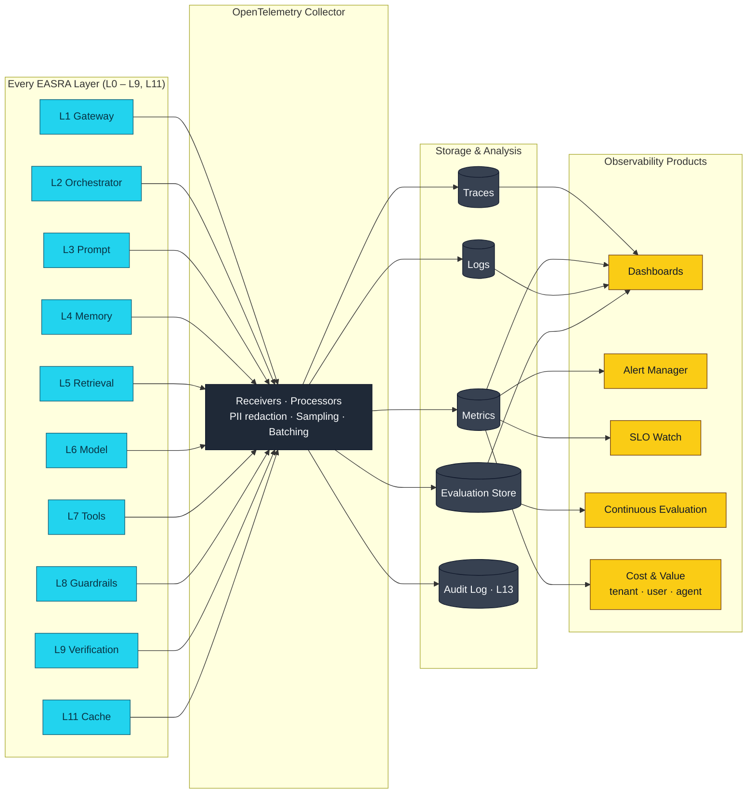

# Observability Plane

Companion diagram to Layer L10 in [Specification 005](../specification/005-layer-definitions.md) and NFR N10 in [Specification 010](../specification/010-nfr.md).

## 1. The observability plane (L10)

## 2. Required signals per layer (summary)

| Layer | Required signals |
|-------|------------------|
| L1 | Auth outcome, latency, rate-limit hit, session load latency |
| L2 | Agent trace, plan step count, wall-clock, per-step latency and cost |
| L3 | Prompt trace (template, version, inputs), token counts, cache hit/miss |
| L4 | Memory type, read/write count, latency, PII classification |
| L5 | Query, retrieval strategy, index latency, result count, rerank latency |
| L6 | Model ID, tokens (prompt/completion/cached), cost, latency, provider, fallback events |
| L7 | Tool ID, arguments (redacted), result, latency, cost, impact class, approval outcome |
| L8 | Checkpoint, guardrail ID, decision, reason, latency |
| L9 | Verdict per check, grader latency, grader cost, escalation events |
| L11 | Hit/miss per tier, saved cost, saved latency, cost per request |

Full signal specification lives in [Specification 006 §IX.All→L10 Telemetry](../specification/006-interface-specification.md#ixall→l10--telemetry).

## 3. Change log

- **0.1.0 (2026-07-05)** — Initial observability plane diagram.
