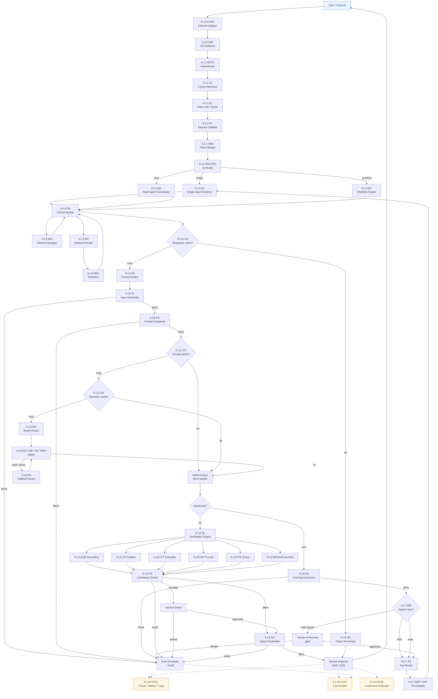

# D-R1 · Master Runtime Execution Flow

The end-to-end execution flow of a single Enterprise AI request across the 16 EASRA layers, showing decision points, cache lookups, guardrail gates, model / tool calls, verification, and response streaming.

This is the **runtime companion** to the [High-Level Architecture (D-L1)](./high-level-architecture.md). Where D-L1 shows the layered structure, D-R1 shows the execution.

## Mermaid



## Key decision points

| # | Decision | Enforced by | Outcomes |
|---|----------|-------------|----------|
| 1 | Response cache hit? | `K-L11-RC` | hit → skip to output guardrails; miss → prompt build. |
| 2 | Input / Prompt guardrails allow? | `K-L8-IG`, `K-L8-PG` | allow / block. |
| 3 | Prompt cache hit? | `K-L11-PC` | hit → skip model. |
| 4 | Semantic cache hit? | `K-L11-SC` | hit → skip model. |
| 5 | Model fault or policy breach? | `K-L6-MR` → `K-L6-FB` | retry via fallback. |
| 6 | Needs tool? | agent | branch to tool subpath. |
| 7 | Tool impact class? | `K-L7-IMP` | read / write / high-impact (→ HITL). |
| 8 | Verification verdict? | `K-L9-CS` | allow / escalate (→ HITL) / block. |
| 9 | Output guardrails allow? | `K-L8-OG` | allow / block. |

## Cross-cutting

- **Observability (L10)** — every node emits traces (W3C TraceContext), metrics, logs. Cost is emitted at every model and tool call.
- **Security (L13)** — every hop carries an identity; PII, secrets, and audit are enforced regardless of path.
- **Governance (L14)** — every model, prompt, and tool used must resolve to a registry-signed artefact.

## What this diagram intentionally omits

- Physical placement (→ [D-D1 Deployment Topology](./deployment-topology.md)).
- Trust boundaries (→ [D-S1 Trust Boundaries](./trust-boundaries.md)).
- Streaming internals (→ D-R6 Cache Lookup Sequence — planned).
- CI / CD (→ [D-O2 CI/CD Pipeline](./cicd-pipeline.md)).

## ASCII fallback (skeleton)

```
User → CHAD → GW → AUTH → AZ → RL → RV → TBM
      → ROUTER → { SA | MA | WF }
      → CB ← (MM, RR→RRK)
      → RCACHE? ─hit→ OG → Stream → User
                 └miss→ PB → IG → PG → PCACHE? → SCACHE? → MR → Model
                                                        ↑        │
                                                        FB ←─────┤ (on fault)
                                                                 ▼
                          Needs tool? ─yes→ AG → IMP{read/write/high} → TR → Tool → SA
                                        └no→ VE → { GRD, CIT, FCT, FMT, POL, BR } → CS
                                             CS→ { allow → OG → Stream ; escalate → HITL ; block → ERR }
Observability (L10), Security (L13), Governance (L14) apply to every step.
```

## Related

- [High-Level Architecture (D-L1)](./high-level-architecture.md)
- [Spec 007 — Data Flow](../specification/007-data-flow.md)
- [Spec 008 — Sequence Diagrams](../specification/008-sequence-diagrams.md)
- [Spec 011 — Capability Model](../specification/011-capability-model.md)
- [Spec 012 — Component Catalogue](../specification/012-component-catalogue.md)
