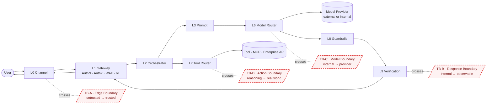
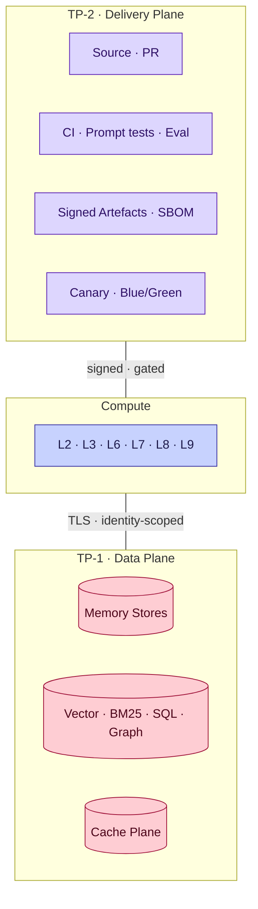

# Trust Boundaries — Diagrams

Companion diagrams to [Specification 009 — Trust Boundaries](../specification/009-trust-boundaries.md).

## 1. The four boundaries on the request path

## 2. Threat mapping (OWASP LLM Top 10)

| Threat | Boundary | Control | Diagrammed at |
|--------|----------|---------|---------------|
| LLM01 Prompt Injection | TB-A / TB-C / TB-D | Input, prompt, tool-arg guardrails; structural prompt boundaries | L8 checkpoints |
| LLM02 Insecure Output Handling | TB-B | Output guardrails + response formatter + schema | L8/L9 → L1 |
| LLM04 Model DoS | TB-A / TB-C | Rate limit + timeouts | L1 · L6 |
| LLM05 Supply Chain | TP-2 · TB-C | Signed artefacts · approved providers | CI/CD · Model Registry |
| LLM06 Sensitive Info Disclosure | TB-B · TP-1 | PII policy · redaction · cache-key policy | L9 · L11 |
| LLM07 Insecure Plugin Design | TB-D | Tool registry · argument guardrails · impact class | L7 · L8 |
| LLM08 Excessive Agency | TB-D | Impact class · approval · audit | L7 · L14 |
| LLM09 Overreliance | TB-B | Verification verdict · human-review escalation | L9 |
| LLM10 Model Theft | TB-A · TB-C | AuthN on APIs · egress policy | L1 · L6 |

Full mapping table lives in [Specification 009 §9](../specification/009-trust-boundaries.md#9-threat-mapping-summary).

## 3. Data plane and delivery plane

## 4. Change log

- **0.1.0 (2026-07-05)** — Initial threat-mapped trust-boundary diagrams.
