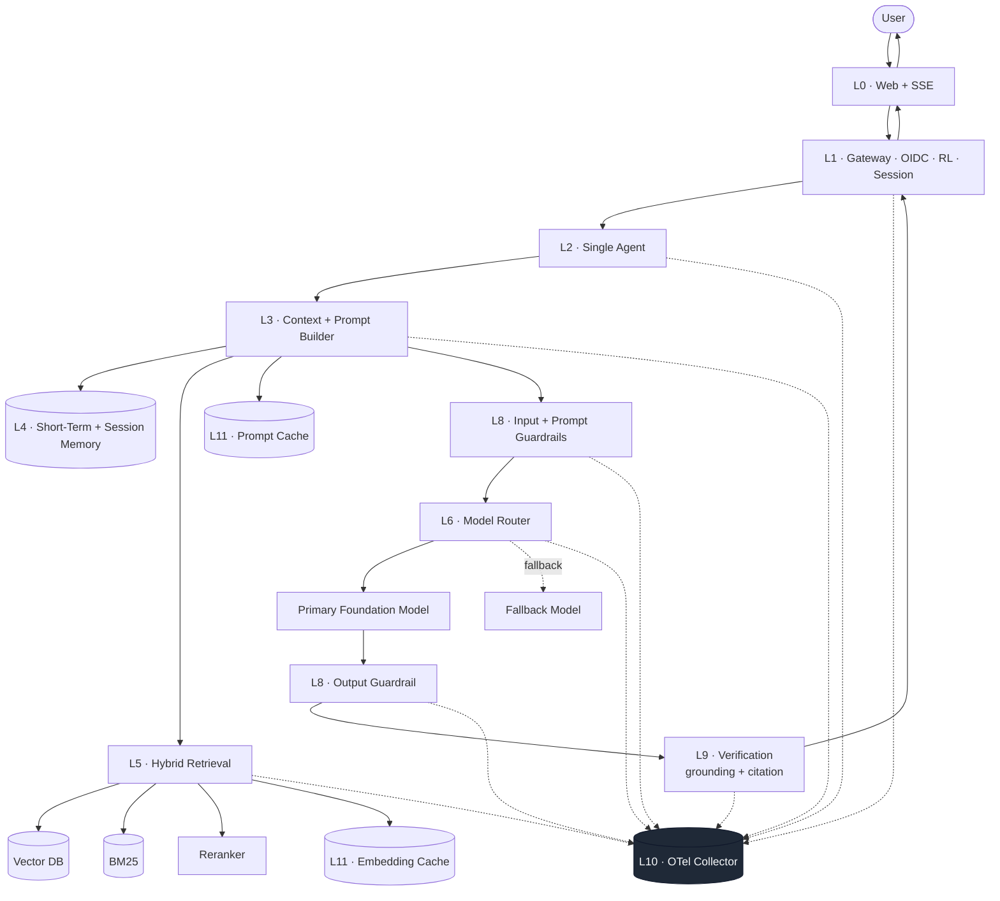

# Example E1 — Single-Agent RAG

> A spec-conformant Enterprise AI system that answers questions grounded in a knowledge base. Single agent, no tool use, hybrid retrieval, verification with citation checking.

## 1. Goal

Answer user questions grounded in an enterprise knowledge base with:

- Authenticated, rate-limited ingress.
- Hybrid retrieval (vector + BM25 + reranker).
- Prompt built from registered template with token-budget enforcement.
- Model call via routed provider with fallback.
- Output guardrails and verification (grounding + citation).
- End-to-end observability with per-request cost.

## 2. Non-goals

- Not multi-agent, not multi-turn planning, no tool calls.
- Not cost-optimised (no semantic cache, single reranker on every query).
- Not multi-region.
- Not a substitute for a production system's evaluation, red-teaming, or governance work.

## 3. EASRA layer coverage

| Layer | Used | Component (this example) |
|-------|------|--------------------------|
| L0 | ✓ | Web SPA with SSE streaming |
| L1 | ✓ | Gateway + OIDC + rate limit + session |
| L2 | ✓ | Single-agent runtime (no planner) |
| L3 | ✓ | Context Builder + Prompt Builder + Prompt Registry (versioned) |
| L4 | ✓ | Short-term (last N turns) + session memory |
| L5 | ✓ | Vector + BM25 + reranker |
| L6 | ✓ | Router with primary + fallback foundation model |
| L7 | – | Not used (no tools in this example) |
| L8 | ✓ | Input, prompt, output guardrails (PII + prompt-injection + toxicity) |
| L9 | ✓ | Grounding + citation checkers |
| L10 | ✓ | OTel traces + metrics + logs + AI attributes |
| L11 | ✓ | Prompt cache + embedding cache |
| L12 | ✓ | CI with prompt tests + evaluation gate |
| L13 | ✓ | Secrets manager + audit for auth events |
| L14 | ✓ | Model / prompt registries + basic policy engine |
| L15 | ✓ | KPI: answer usefulness + cost per answer |

## 4. Architecture



## 5. Sequence (S3 · RAG)

Refer to [Specification 008 §4 — S3 RAG Query](../../specification/008-sequence-diagrams.md#4-s3--rag-query).

## 6. Guardrails and verification

| Checkpoint | Guardrails |
|------------|------------|
| Input | Prompt injection detector, PII detector, toxicity classifier |
| Prompt | Structural boundaries (system / user / grounding), length cap |
| Output | PII leak detector, format enforcer |

| Verification | What it checks |
|--------------|----------------|
| Grounding | Every claim maps to a retrieved chunk |
| Citation | Every citation resolves to a valid source in the source registry |

## 7. Observability

Every request emits: OTel trace, per-layer latency, model ID, prompt / completion / cached tokens, cost, guardrail decisions, verification verdict.

## 8. Cost profile (illustrative shape only — measure before quoting)

Per request, the dominant costs are model tokens and reranker. Embedding cache and prompt cache reduce cost on repeat queries. See [Specification 010 §N6](../../specification/010-nfr.md#8-n6--cost) for how to budget.

## 9. Data classification

- User input: **Internal** by default; escalated to **Confidential** if PII detected.
- Retrieved chunks: inherited from source registry (public / internal / confidential).
- Session memory: **Confidential**; retention 30 days by default.

## 10. Repository layout (planned)

```
single-agent-rag/
├── README.md              (this file)
├── architecture.md        (extended architecture notes)
├── prompts/               (registered template versions)
├── policies/              (registered policies)
├── indexes/               (source registry + chunker config)
├── infra/                 (Kubernetes manifests, terraform stubs, drawio)
├── src/                   (spec-conformant reference implementation slice)
└── tests/                 (unit, contract, prompt, evaluation)
```

Code lands with the reference implementation in [`../../reference-implementation/`](../../reference-implementation/).
