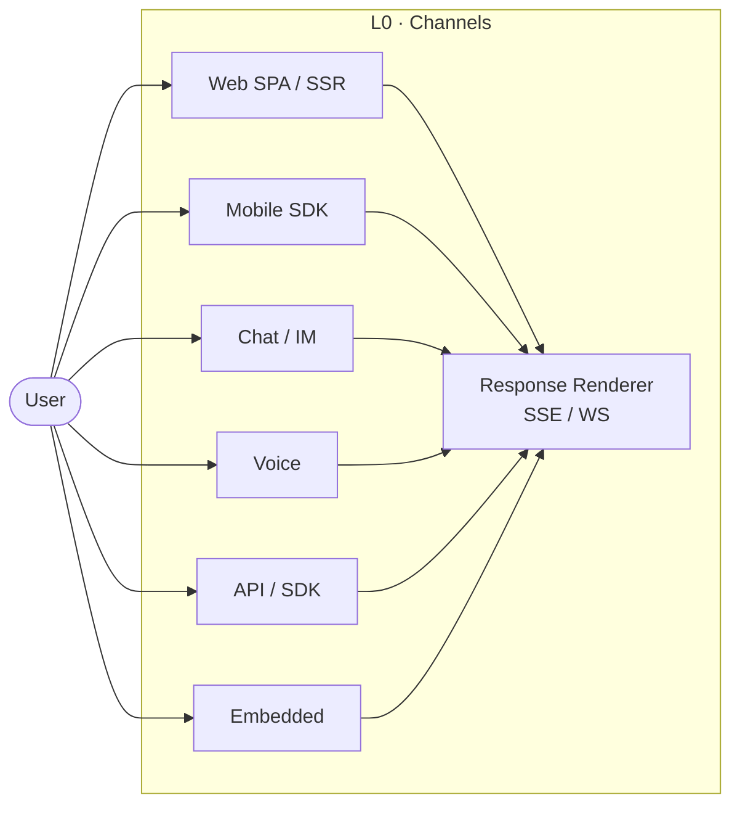

# L0 — Channels & User Experience

| Field | Value |
|-------|-------|
| Layer | L0 |
| Depends on Specs | 004, 005, 006 |
| Status | Skeleton |

## 1. Purpose

L0 is where an Enterprise AI system meets its users. It owns the surfaces (web, mobile, chat, voice, API, SDK, embedded) that receive requests and render responses. L0 is *never* the place for AI decisioning — that lives from L2 downward.

## 2. Problem statement

Enterprise AI systems must present the same reasoning capability across many surfaces without leaking business logic, credentials, or model behaviour into the channel.

## 3. Why this layer exists

Channels evolve independently of reasoning. New surfaces (voice, embedded devices, chat interfaces) must plug in without changing the rest of the system. L0 isolates surface concerns so that L1+ can evolve on their own cadence.

## 4. Responsibilities

- **In scope.** Channel adapters, session-token handling on the client, response rendering including streaming, user-facing error presentation, accessibility, localisation.
- **Out of scope.** Authentication (L1), any AI decisioning, business logic.

## 5. Architecture

## 6. Components

- **Channel Adapter** — per-surface adapter converting user intent to `IX.L0→L1 ClientRequest`.
- **Response Renderer** — displays or vocalises the response, including streaming.
- **Streaming Client** — SSE / WebSocket / gRPC-web client.

## 7. Design principles

Dominant: **P10 Evolvability** (channels come and go), **P5 Loose Coupling** (channel never depends on L2+ internals), **P4 Observability** (client-side telemetry).

## 8. Patterns

- BFF (Backend-for-Frontend) *inside* L1, not L0.
- Streaming responses with client back-pressure.
- Optimistic UI with server confirmation.

## 9. Anti-patterns

- Calling model APIs directly from the client.
- Storing credentials or secrets in client code.
- Encoding business logic in the channel.

## 10. Failure modes

| Failure | Degraded mode |
|---------|---------------|
| Backend unavailable | Cached UI shell + retry queue |
| Streaming disconnected | Resume via last-event-id, else finalise with partial response |

## 11. Observability

Client-side: channel type, correlation ID, client latency, error rate, time-to-first-token, accessibility events.

## 12. Security

Outside all trust boundaries. Session tokens are opaque. Never handles secrets. Never sees structured PII.

## 13. Production checklist

- [ ] All channels attach correlation ID.
- [ ] Streaming is resumable.
- [ ] Client meets WCAG 2.2 AA (or the stated level).
- [ ] Localisation covers the required locales.
- [ ] Error UI matches the L1 error taxonomy in [Spec 006](../specification/006-interface-specification.md).

## 14. References

- W3C WCAG 2.2
- W3C Server-Sent Events specification
- OWASP Web Top 10
