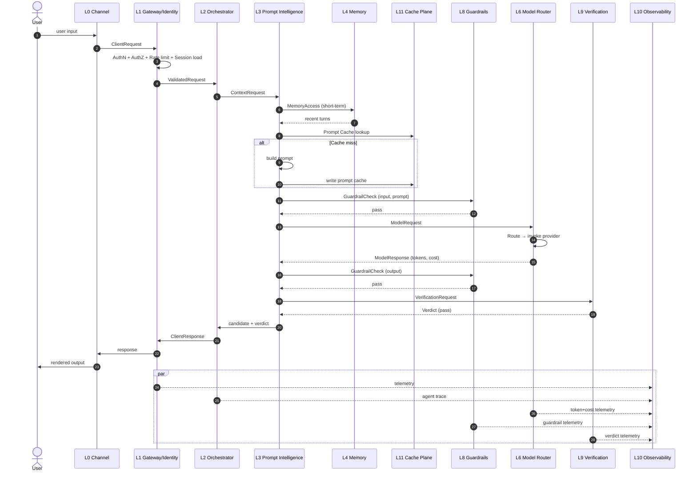
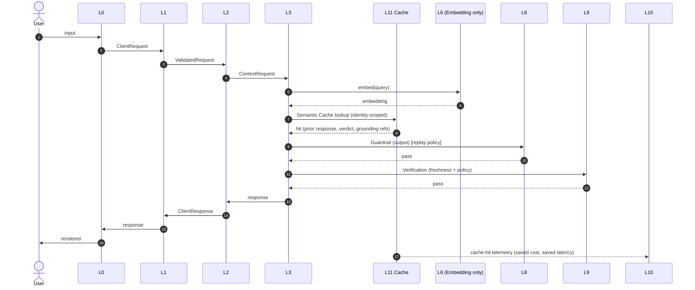
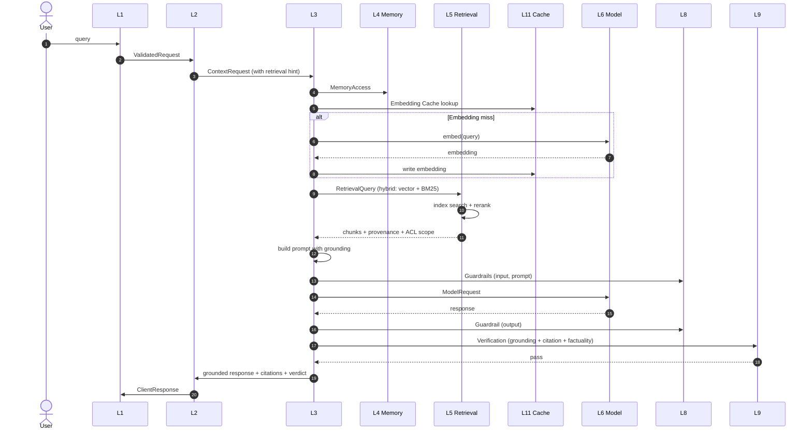
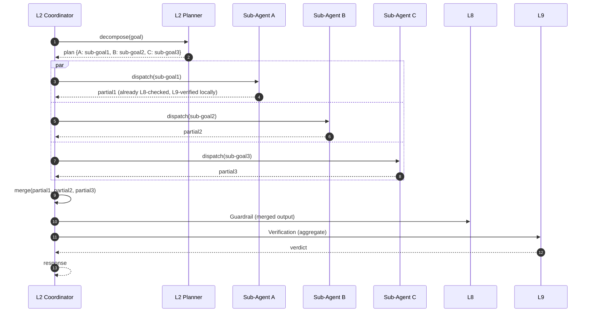
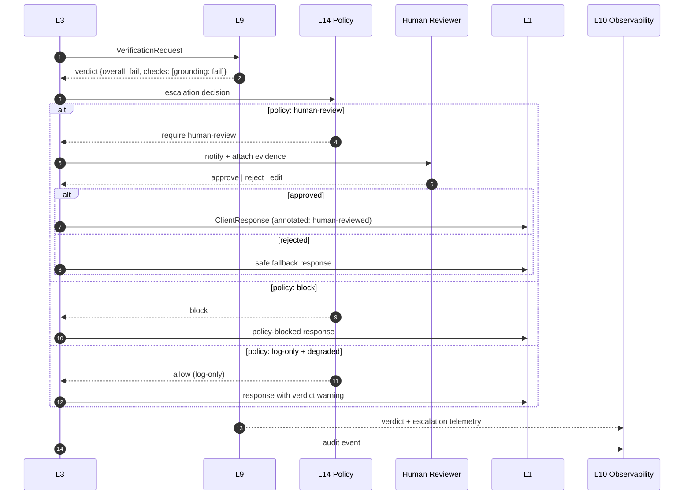
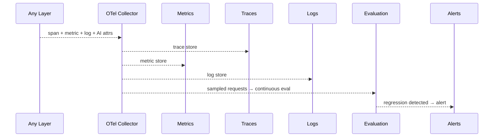

# Specification 008 — Sequence Diagrams

| Field | Value |
|-------|-------|
| Specification | EASRA-SPEC-008 |
| Title | Sequence Diagrams |
| Version | 0.1.0 (Draft) |
| Status | Draft |
| Depends on | 001–007 |

---

## 1. Purpose

This specification captures the canonical request sequences through EASRA. Each sequence shows the layers, interfaces, cache interactions, guardrail checkpoints, verification, and observability. The diagrams are the reference for what a spec-conformant system does in each mode.

Six canonical sequences are defined; additional sequences (batch, async workflow, event-driven, disaster recovery) are reserved for future specifications.

| # | Sequence | Mode | Streaming | Tool use | Multi-agent |
|---|----------|------|-----------|----------|-------------|
| S1 | Simple Chat | Sync | Optional | No | No |
| S2 | Cached Chat | Sync | Optional | No | No |
| S3 | RAG Query | Sync | Optional | No | No |
| S4 | Single-Agent Tool Use | Sync | Optional | Yes | No |
| S5 | Multi-Agent | Sync | Optional | Yes | Yes |
| S6 | Verification Failure & Escalation | Sync | – | Any | Any |

Diagrams below use Mermaid `sequenceDiagram`. Where a step is optional, it is annotated `[optional]`.

---

## 2. S1 — Simple Chat

Purpose: single-turn generation with no retrieval and no tools.



**Observability signals.** Trace ID, prompt trace, model ID, token counts, cost, all guardrail verdicts, verification verdict, end-to-end latency.

---

## 3. S2 — Cached Chat (semantic cache hit)

Purpose: exploit L11 semantic cache to serve a prior response.



**Notes.** Cached responses still traverse L8 (with replay policy) and L9 (freshness + policy) — a cached response is not exempt from current policy.

---

## 4. S3 — RAG Query

Purpose: grounded answer with retrieval.



**Verification focus.** L9 asserts (a) every claim maps to a chunk in `grounding`, (b) every citation resolves to a valid source, (c) no fabricated citations. On any failure the escalation path in S6 applies.

---

## 5. S4 — Single-Agent Tool Use

Purpose: agent plans, calls one or more tools via MCP, produces a grounded response.

```mermaid
sequenceDiagram
    autonumber
    participant L2 as L2 Agent
    participant L3 as L3 Prompt
    participant L6 as L6 Model
    participant L7 as L7 Tool Router
    participant L8 as L8 Guardrails
    participant L14 as L14 Policy Engine
    participant MCP as MCP Server
    participant L9 as L9 Verification

    L2->>L3: ContextRequest (with tool schemas)
    L3->>L6: ModelRequest
    L6-->>L3: response { toolCalls: [t1(args)] }
    L3->>L2: propagate tool call
    L2->>L8: GuardrailCheck (tool-arg)
    L8-->>L2: pass
    L2->>L14: PolicyDecision (impactClass, args, context)
    alt high-impact
        L14-->>L2: require-approval
        L2->>L2: pause; request approval (H-i-T-L)
        L2->>L14: approval evidence
        L14-->>L2: allow
    else read/write within policy
        L14-->>L2: allow
    end
    L2->>L7: ToolInvocation
    L7->>MCP: invoke
    MCP-->>L7: result + side-effect record
    L7-->>L2: ToolResult
    L2->>L3: extend context with tool result
    L3->>L6: ModelRequest (with result)
    L6-->>L3: final response
    L3->>L8: Guardrail (output)
    L3->>L9: Verification
    L9-->>L3: verdict
```

**Notes.** The loop `model → tool → model` may repeat until termination (bounded by L2 step count and wall-clock). Every tool call is audited (F12).

---

## 6. S5 — Multi-Agent

Purpose: coordinator dispatches sub-agents in parallel; merges results.



**Bulkheads.** Sub-agent failure is isolated by the coordinator (P8). Partial success is allowed only if policy permits and the aggregate verdict passes.

---

## 7. S6 — Verification Failure & Escalation

Purpose: response fails verification; escalation path invoked.



**Notes.** The escalation policy is defined per data class, tenant, and impact context. All escalations emit audit events (F12).

---

## 8. Cross-cutting: telemetry on every hop

All sequences above emit telemetry at every hop. The observability layer (L10) is deliberately omitted from most arrows for readability; conformance requires it on every request path.



---

## 9. Rendering notes

- Mermaid renders natively on GitHub. Copy-paste any block into any Mermaid-capable tool for adaptation.
- The `diagrams/` folder holds source (`.mmd`) and rendered exports (`.svg`, `.png`) for use in slides and papers.
- When adapting a diagram, keep layer names, interface names, and checkpoint names unchanged — that is the spec.

## 10. Change Log

- **0.1.0 (2026-07-05)** — Initial draft. Six canonical sequences defined.

## 11. Next Specification

Continue to [Specification 009 — Trust Boundaries](./009-trust-boundaries.md).
