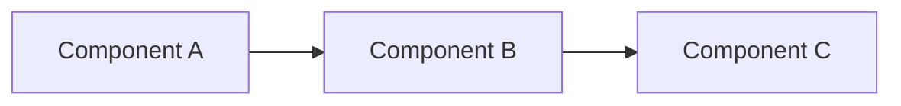

# <PROJECT NAME>

*One sentence: what this repository is, for whom, and why.*

**Part of the EASRA ecosystem** · [What is EASRA?](https://github.com/KarthikeyanDhanakotti/EASRA)

---

## Elevator pitch

*Two to three sentences answering: what problem it solves, who benefits, and how it relates to EASRA (implements which capability / satisfies which specification / references which components).*

## Architecture

*One Mermaid or ASCII diagram. Every named component MUST appear in the [EASRA Component Catalogue](https://github.com/KarthikeyanDhanakotti/EASRA/blob/main/specification/012-component-catalogue.md) — otherwise define it here with justification.*



## Quick start

```bash
# Clone
git clone https://github.com/<owner>/<repo>.git
cd <repo>

# Install / build
<TODO: 1–3 commands>

# Run
<TODO: 1 command that produces a visible result>
```

## Screenshot / example output

*One screenshot or a short recorded output block.*

## Diagrams

*Link to a `diagrams/` folder or list inline diagrams.*

## Roadmap

*Phased, no dates, checkable items.*

- [ ] Phase 1 — <goal>
- [ ] Phase 2 — <goal>

Long-form roadmap in [`ROADMAP.md`](./ROADMAP.md).

## Examples

*At least one runnable example, in an `examples/` folder.*

## References

- EASRA Specification: <link>
- EASRA Capability Model: <link>
- Related standards: <NIST AI RMF / ISO 42001 / OWASP LLM / …>
- Prior art: <papers, other projects>

## Research

*Forward-looking work that does not yet ship — link to an `adr/` or `research/` folder.*

## Contributing

See [`CONTRIBUTING.md`](./CONTRIBUTING.md). Structural changes require an [ADR](./adr/).

## Governance

*If this is a standard-family repo: how versions are cut, how deprecations work, how the ADR process runs. Otherwise: single-maintainer note.*

## Changelog

See [`CHANGELOG.md`](./CHANGELOG.md).

## License

- Documentation, specifications, diagrams: [CC-BY-4.0](./LICENSE)
- Code and reference implementation: [Apache License 2.0](./LICENSE)

## Maintainer

**Karthikeyan Dhanakotti** — [@KarthikeyanDhanakotti](https://github.com/KarthikeyanDhanakotti)

---

## Repository Quality Checklist

Before publishing or pinning this repository, ensure it satisfies the [EASRA Repository Quality Checklist](https://github.com/KarthikeyanDhanakotti/EASRA/blob/main/checklists/repository-quality.md).
